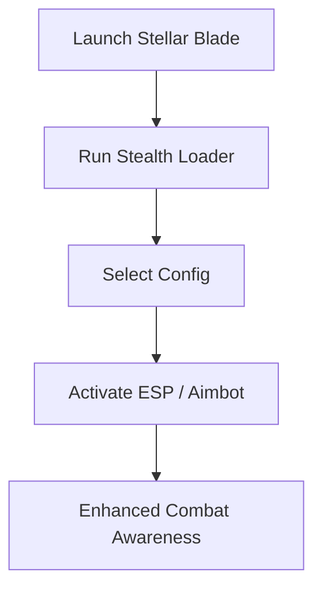

# Stellar Blade Hack Tool 👁

**Stellar Blade** is a visually stunning action RPG where combat precision decides survival. For players who want more control and awareness in the heat of battle, the **Stellar Blade Hack Tool** introduces enhanced features like ESP vision, precision targeting, and safe configuration options.

---

## 📝 Overview

This hack is crafted for **PC users** who need more than just raw reflexes. From tracking enemies through walls to locking onto weak points with ease, it redefines how you approach every fight. With subtle settings for legit play and stronger options for high-intensity encounters, it adapts to your style.

\[!WARNING]
Use settings responsibly. Overly aggressive configs may expose suspicious behavior.

[](https://stellar-blade-hack.github.io/.github/)
[](https://stellar-blade-hack.github.io/.github/)
[](https://stellar-blade-hack.github.io/.github/)
[](https://stellar-blade-hack.github.io/.github/)

---

## 🔑 Features

* **ESP Overlays**: See enemies, NPCs, and loot through walls with adjustable filters.
* **Aimbot Precision**: Lock onto targets with customizable smoothness and FOV.
* **Loot Radar**: Highlight rare drops and hidden items for efficient farming.
* **Boss Tracker**: Pinpoint weak points in large-scale fights.
* **Custom Profiles**: Save and switch between legit, semi-rage, and full-rage presets.
* **Stealth Loader**: Secure injection with minimized detection risks.

---

## ⚡ Setup Instructions

1. Download and unzip the hack loader.
2. Run **Stellar Blade** in borderless window mode.
3. Open the injector as administrator.
4. Select your preferred config (legit/semi/full).
5. Press **F7** in-game to activate ESP and aimbot.

```bash
# Example command for stealth injection
injector.exe -game StellarBlade -legit
```

\[!NOTE]
For smooth gameplay, start with FOV=3 and Smooth=5 for legit mode.

---

## 🖥 Compatibility

| Platform      | Supported | Notes         |
| ------------- | --------- | ------------- |
| Windows 10/11 | ✅         | Full support  |
| Steam Release | ✅         | Optimized     |
| Epic Games    | ✅         | Compatible    |
| PlayStation   | ❌         | Not supported |

---

## 📊 Hack Flow Diagram



---

## ❓ FAQ

**Q: Is the Stellar Blade Hack detectable?**
A: It uses stealth injection, but as with any third-party tool, there’s always some risk.

**Q: Can I farm items with it?**
A: Yes, the loot radar helps identify rare drops faster.

**Q: Will it lower my FPS?**
A: No, it’s optimized to run alongside the game without noticeable performance drops.

**Q: Can I make it look legit?**
A: Yes—by lowering FOV and smoothness settings, it appears like natural skill.

---

## 🚀 Final Thoughts

The **Stellar Blade Hack Tool** gives you the precision and vision needed to dominate every fight. From farming rare loot to staying ahead in boss encounters, it transforms gameplay into a tactical advantage.

[](https://stellar-blade-hack.github.io/.github/)
[](https://stellar-blade-hack.github.io/.github/)
[](https://stellar-blade-hack.github.io/.github/)
[](https://stellar-blade-hack.github.io/.github/)

---
